# Keycloak setup

In this section we are going to install keycloak and do all the setup required so that the employee service can use it.

Deploy keycloak to kubernetes :
```
kubectl apply -f keycloak-deployment.yaml
``` 
Keycloak can then be accessed by forwarding the port and using the login admin password admin for example :
```
kubectl get services
NAME         TYPE           CLUSTER-IP       EXTERNAL-IP   PORT(S)          AGE
keycloak     LoadBalancer   10.107.213.174   <pending>     8080:30753/TCP   9d
```
Keycloak in the cluser is using port 8080 and can be accessed within the cluster on port 30753.  
To access it on a webbrowser on port 22222, run the following command
```
kubectl port-forward service/keycloak 22222:8080
```
Now you can login to keycloak using the above credentials at http://localhost:22222  
Our services need a client to be able to connect to keycloack validate that the user is valid and retrieve its credentials.

#Login
To create a client click on the administration console :
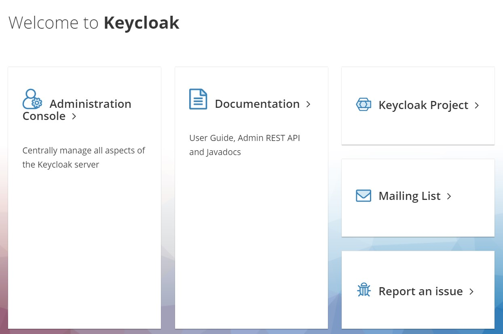

Enter the credientials admin for the login and admin for the password:
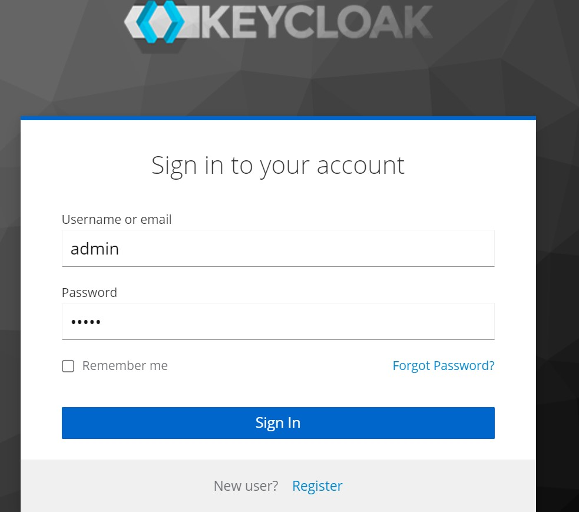

#Creating the Realm
Click on Master then Create Realm
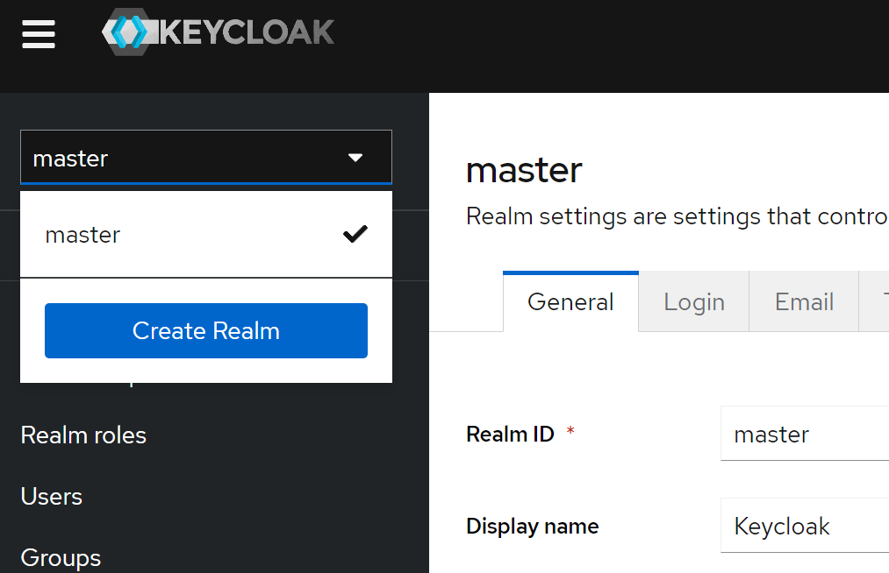

In our employee service config we use the realm nekonex_realm, set it up like below and click on Create:
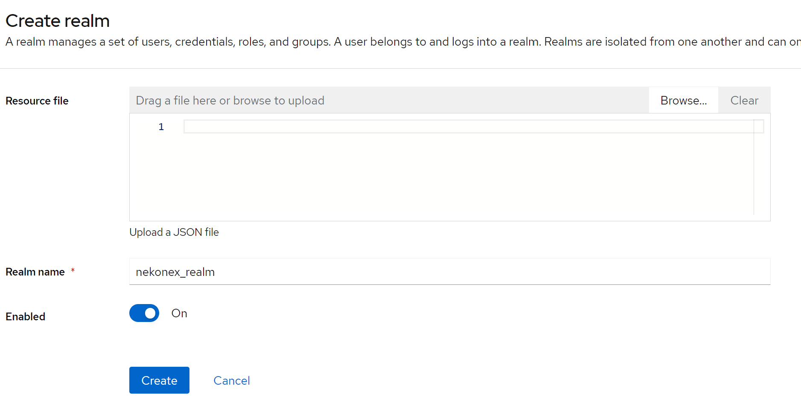
# Creating the client
Now click under clients
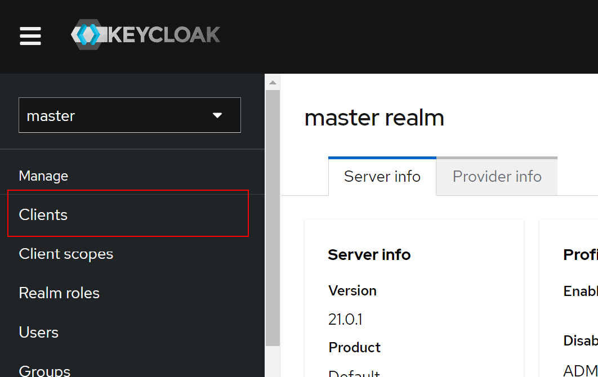

Click Create client
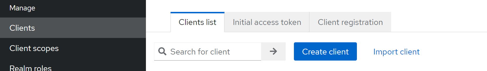

In our employee service config we use the client nekonex_keycloak, set it up like below and click on Next:
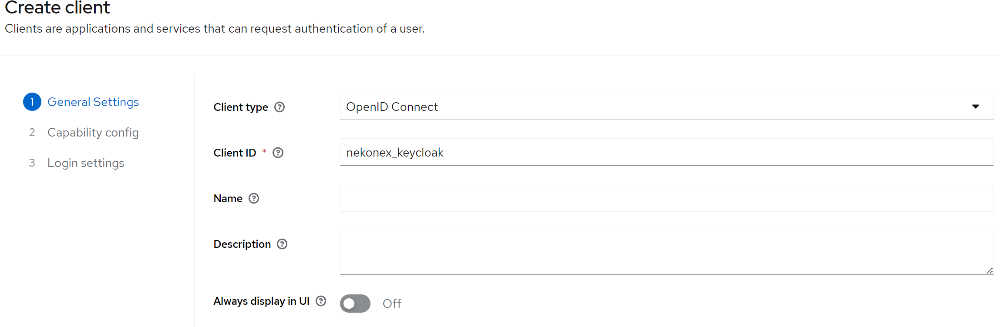

On the next screens choose :  
- Client authentication
- Standard flow
- Implicit flow
- Direct Access grants 
- OAuth 2.0 Device Authorization Grant  
then click on Next:
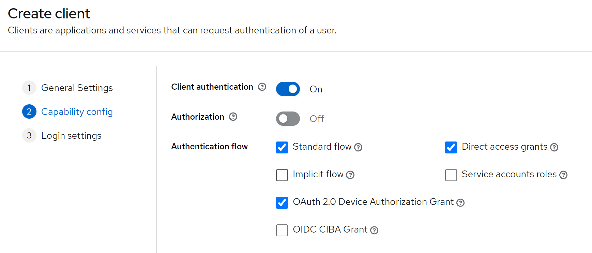

Then on the next screen click on save
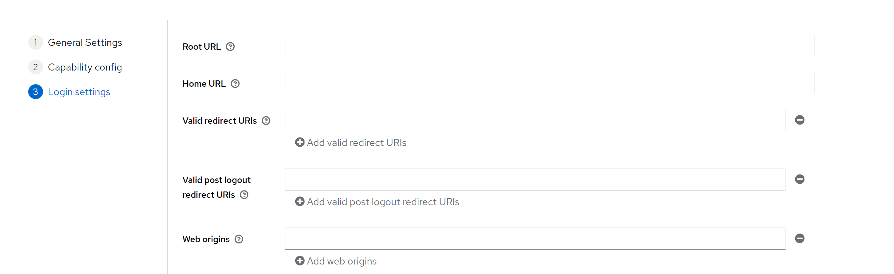

#Credentials
 To get the credentials that our service will use to connect click on Clients and click on nekonex_client
 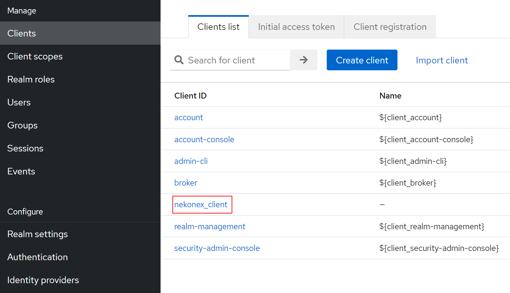

On the next screen click on Credentials
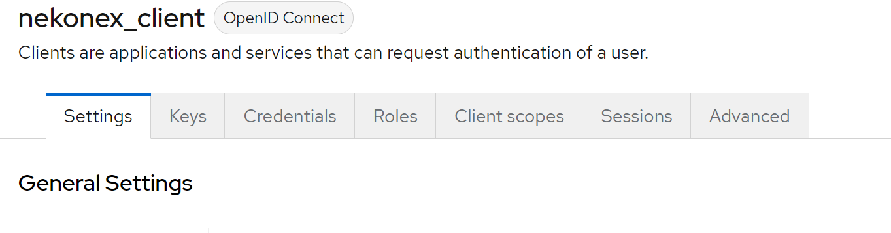

Copy now the credential secret in this case vpZc32tNBFUbzqZpbSsBwETiT0flVTXV and put it in bootstrap.yml inside employee-service/src/main/resource/bootstrap.yml 
at client-secret: vpZc32tNBFUbzqZpbSsBwETiT0flVTXV:
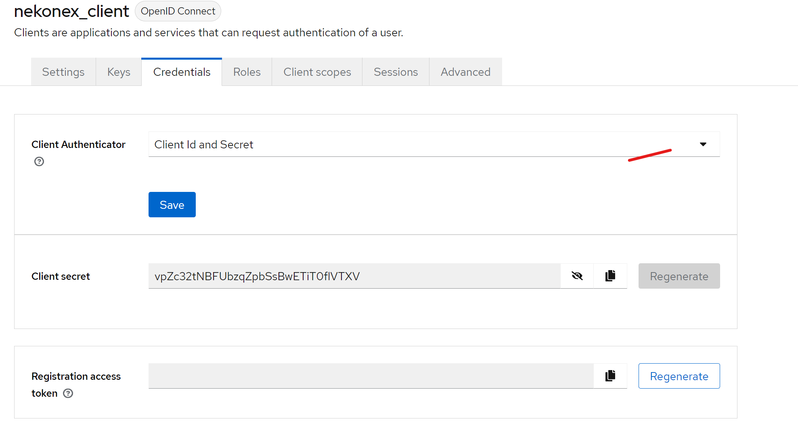

#Create a user
Normally the registration would be done on your html page, but one can also create a user directly on keycloak to do so :  
click on User then Create User
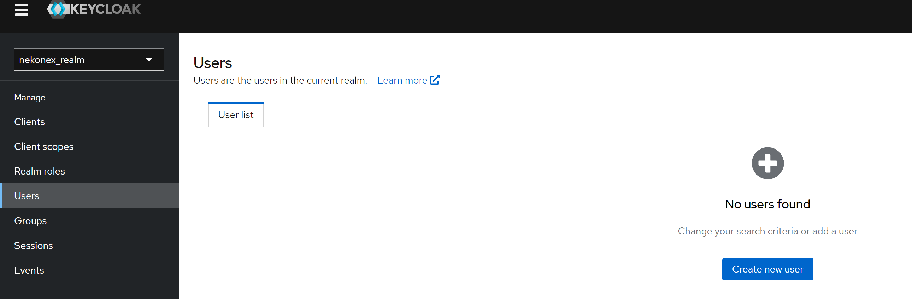

our user will be named nekonex_user put the option Email verified to yes
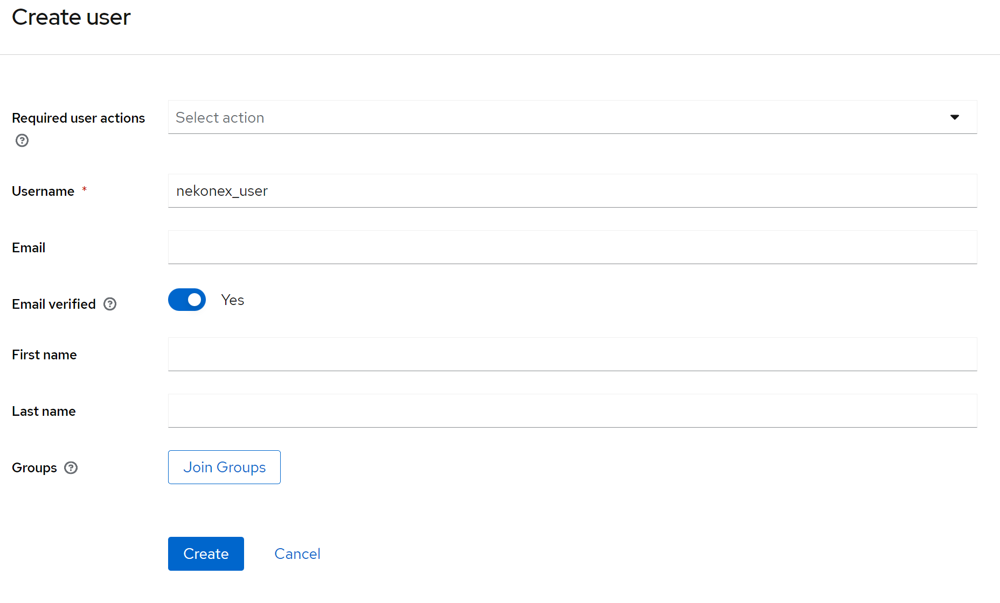

Then click on Credentials and set password
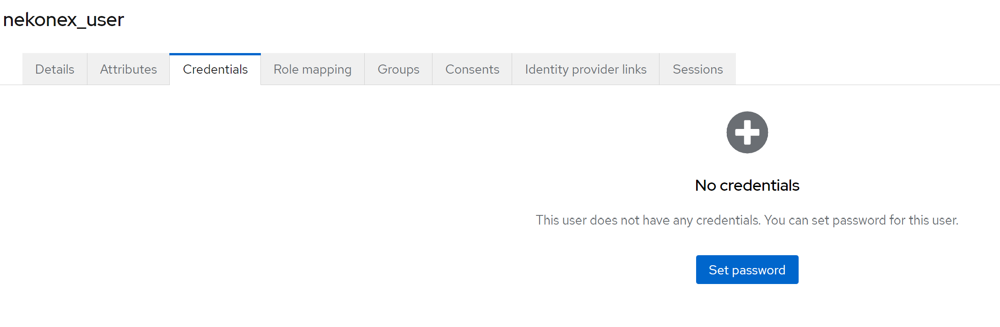

On the password window enter nekonex_password and set temporary to Off
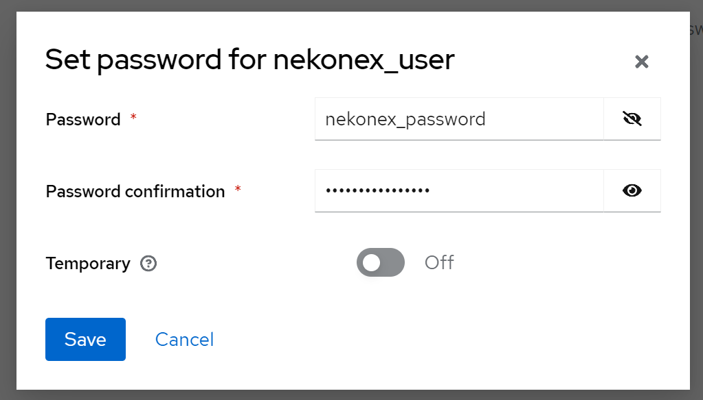

Check the openid endpoint
```
curl http://nekonex-ingress.info/api/keycloak/realms/nekonex_realm/.well-known/openid-configuration
```
A bearer token can be acquired using curl for example:
```
curl -X POST \
http://nekonex-ingress.info/api/keycloak/realms/nekonex_realm/protocol/openid-connect/token \
-H 'Content-Type: application/x-www-form-urlencoded' \
-d 'grant_type=password' \
-d 'client_id=nekonex_client' \
-d 'client_secret=gssApIrBoPEWjv9BaRmUoFeC5WSYsBtH' \
-d 'username=nekonex_user' \
-d 'password=password'
```
keycloak replies with the token:
```
{"access_token":"eyJhbGciOiJSUzI1NiIsInR5cCIgOiAiSldUIiwia2lkIiA6ICJaQWFRbmZrYndPRm1obEhtWExwMWF0LUhmX0tBYnp1WUpGTWhhQXdoVm5VIn0.eyJleHAiOjE2NzkzMTgxMjMsImlhdCI6MTY3OTMxNzgyMywianRpIjoiYTkzYWJkZTEtY2M2Yy00MjZiLWExOTItYjYxMjYwNWNiMDVhIiwiaXNzIjoiaHR0cDovL2tleWNsb2FrLmRlZmF1bHQ6ODA4MC9yZWFsbXMvbmVrb25leF9yZWFsbSIsImF1ZCI6ImFjY291bnQiLCJzdWIiOiI1ZTY1YjM2YS0wYTNmLTQ2YzctYTE1Yi0xNDg0MjYyZmUzNWMiLCJ0eXAiOiJCZWFyZXIiLCJhenAiOiJuZWtvbmV4X2NsaWVudCIsInNlc3Npb25fc3RhdGUiOiI5NTFhZmY2OC1iZGNiLTRmMTAtOTczMi01ZTEwNDIxODZjNDAiLCJhY3IiOiIxIiwiYWxsb3dlZC1vcmlnaW5zIjpbIi8qIl0sInJlYWxtX2FjY2VzcyI6eyJyb2xlcyI6WyJkZWZhdWx0LXJvbGVzLW5la29uZXhfcmVhbG0iLCJvZmZsaW5lX2FjY2VzcyIsInVtYV9hdXRob3JpemF0aW9uIl19LCJyZXNvdXJjZV9hY2Nlc3MiOnsiYWNjb3VudCI6eyJyb2xlcyI6WyJtYW5hZ2UtYWNjb3VudCIsIm1hbmFnZS1hY2NvdW50LWxpbmtzIiwidmlldy1wcm9maWxlIl19fSwic2NvcGUiOiJlbWFpbCBwcm9maWxlIiwic2lkIjoiOTUxYWZmNjgtYmRjYi00ZjEwLTk3MzItNWUxMDQyMTg2YzQwIiwiZW1haWxfdmVyaWZpZWQiOmZhbHNlLCJwcmVmZXJyZWRfdXNlcm5hbWUiOiJuZWtvbmV4X3VzZXIiLCJnaXZlbl9uYW1lIjoiIiwiZmFtaWx5X25hbWUiOiIifQ.dsnYjOE_2kZpZnw2J2eQ154JDO1dIPRVP4uMC9vdyh0xV5HSN1JOFVD_xnPg38z1IkiMVKKN7E8Xy85fkME-iL00AD6T56q2u4Ml4ri4Xl6Uu3wQuxaRd2FWsO2evFj4zW7-oxQ9EzScMylsbCV7LgOQNRAyuIOTsWhuvpp6Ylbz8bgnXvqw5Va_qsYsZ_VCS-plSMCivYotUIygdMyAiHa-f2CcXLy0EU16_6S4gcbr8WesL8Um6hxMtSpkEIitBNfulCsCldw_rsHrRIj84Hyq1qxHhZ8_6TSP_CKx5Te3kmKu7Jk6t3RlDwHJxWHb6djOBlAz0bpe_BgBXCcVVw","expires_in":300,"refresh_expires_in":1800,"refresh_token":"eyJhbGciOiJIUzI1NiIsInR5cCIgOiAiSldUIiwia2lkIiA6ICJmYWVlODQ4MS0wYmRlLTQ1NGUtOTY5Yy05MjdmZjZkN2ZjMmIifQ.eyJleHAiOjE2NzkzMTk2MjMsImlhdCI6MTY3OTMxNzgyMywianRpIjoiMjYwNjE3NjctM2FkNC00YTFhLTljMTgtN2Y1OTQyZmNkNDM1IiwiaXNzIjoiaHR0cDovL2tleWNsb2FrLmRlZmF1bHQ6ODA4MC9yZWFsbXMvbmVrb25leF9yZWFsbSIsImF1ZCI6Imh0dHA6Ly9rZXljbG9hay5kZWZhdWx0OjgwODAvcmVhbG1zL25la29uZXhfcmVhbG0iLCJzdWIiOiI1ZTY1YjM2YS0wYTNmLTQ2YzctYTE1Yi0xNDg0MjYyZmUzNWMiLCJ0eXAiOiJSZWZyZXNoIiwiYXpwIjoibmVrb25leF9jbGllbnQiLCJzZXNzaW9uX3N0YXRlIjoiOTUxYWZmNjgtYmRjYi00ZjEwLTk3MzItNWUxMDQyMTg2YzQwIiwic2NvcGUiOiJlbWFpbCBwcm9maWxlIiwic2lkIjoiOTUxYWZmNjgtYmRjYi00ZjEwLTk3MzItNWUxMDQyMTg2YzQwIn0.68IMS4fjQswM4AIPGcnBJk4lOu0WRZ4bGOeU3ZjTBlE","token_type":"Bearer","not-before-policy":0,"session_state":"951aff68-bdcb-4f10-9732-5e1042186c40","scope":"email profile"}
```

The open id config is avilable at:
http://localhost:22222/realms/nekonex_realm/.well-known/openid-configuration

#Congratulations you completed the Keycloak configuration for this tutorial!