# Keycloak setup

In this section we are going to install keycloak and do all the setup required so that the employee service can use it.

Deploy keycloak to kubernetes :
```
kubectl apply -f keycloak-deployment.yaml
``` 
Keycloak can then be accessed by forwarding the port and using the login admin password admin for example :
```
kubectl get services
NAME         TYPE           CLUSTER-IP       EXTERNAL-IP   PORT(S)          AGE
keycloak     LoadBalancer   10.107.213.174   <pending>     8080:30753/TCP   9d
```
Keycloak in the cluser is using port 8080 and can be accessed within the cluster on port 30753.  
To access it on a webbrowser on port 22222, run the following command
```
kubectl port-forward service/keycloak 22222:8080
```
Now you can login to keycloak using the above credentials at http://localhost:22222  
Our services need a client to be able to connect to keycloack validate that the user is valid and retrieve its credentials.

#Login
To create a client click on the administration console :
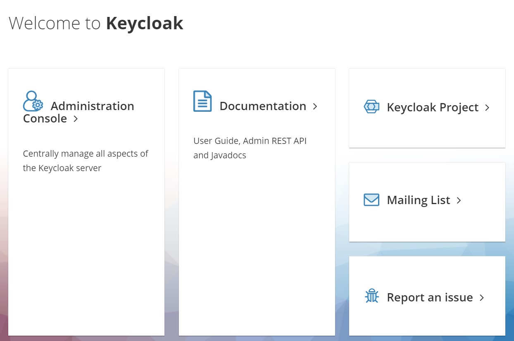

Enter the credientials admin for the login and admin for the password:
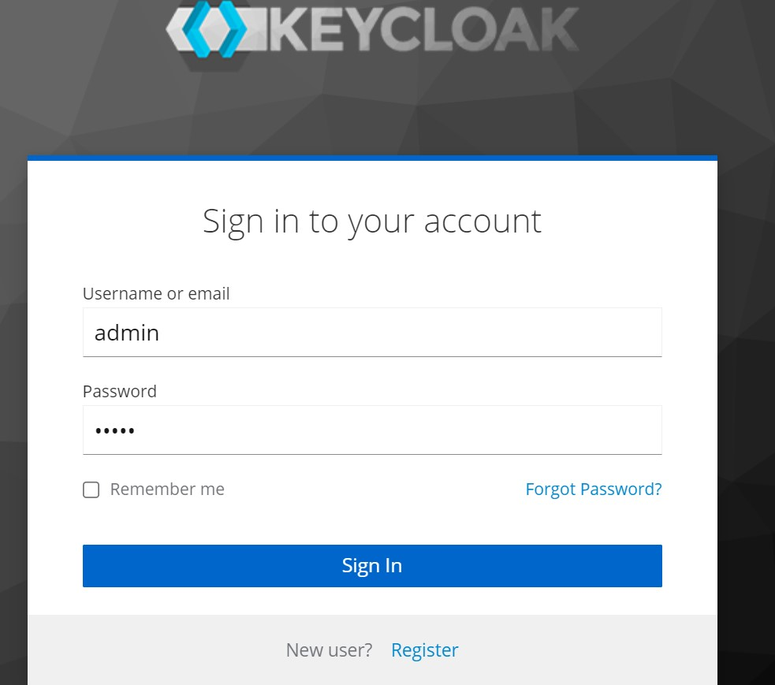

#Creating the Realm
Click on Master then Create Realm
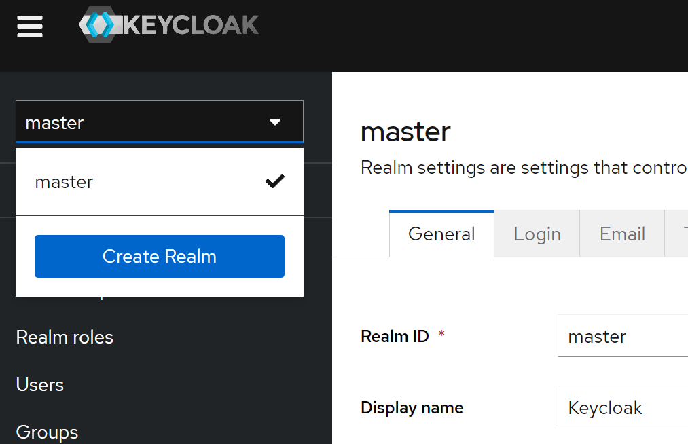

In our employee service config we use the realm nekonex_realm, set it up like below and click on Create:

# Creating the client
Now click under clients
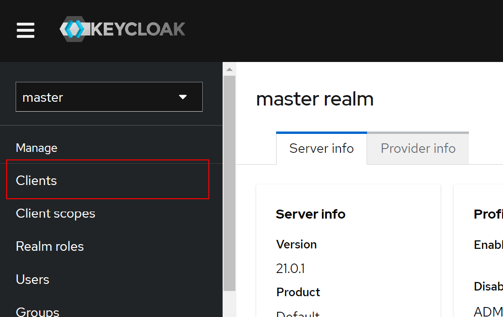

Click Create client
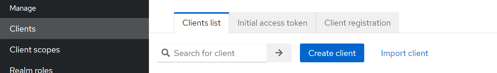

In our employee service config we use the client nekonex_keycloak, set it up like below and click on Next:
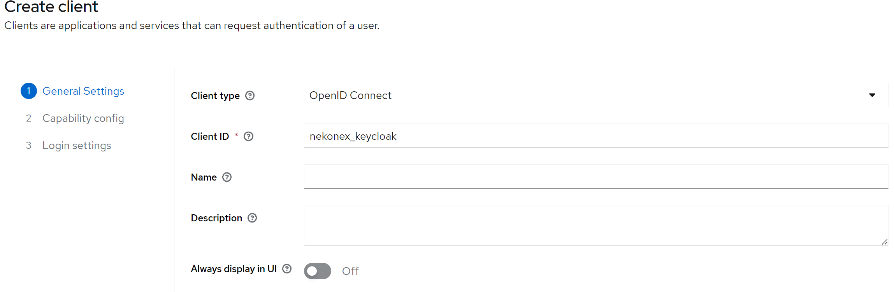

On the next screens choose :  
- Client authentication
- Standard flow
- Direct Access grants 
- OAuth 2.0 Device Authorization Grant  
then click on Next:


Then on the next screen click on save
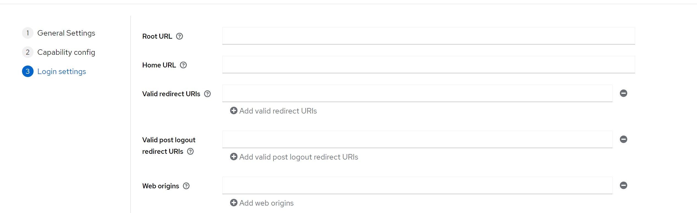

#Credentials
 To get the credentials that our service will use to connect click on Clients and click on nekonex_client
 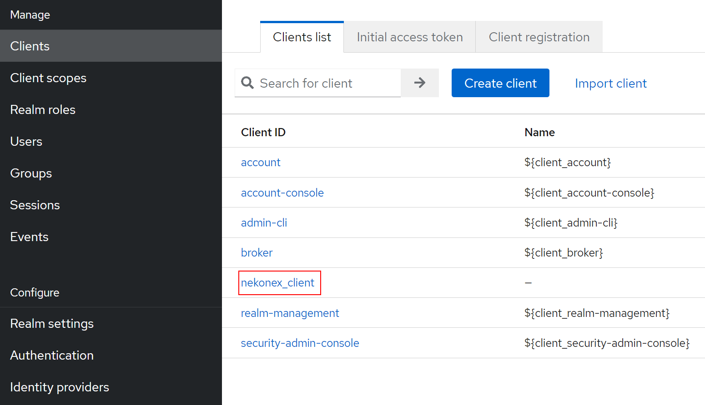

On the next screen click on Credentials


Copy now the credential secret in this case vpZc32tNBFUbzqZpbSsBwETiT0flVTXV and put it in bootstrap.yml inside employee-service/src/main/resource/bootstrap.yml 
at client-secret: vpZc32tNBFUbzqZpbSsBwETiT0flVTXV:
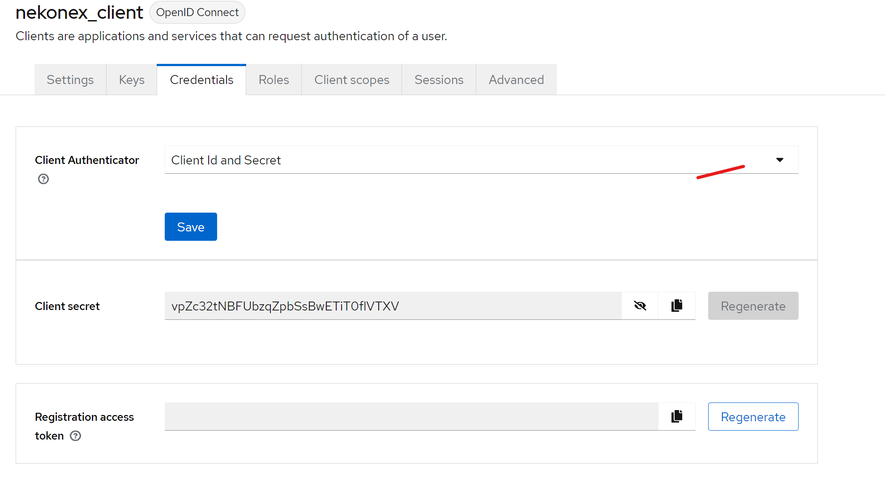

#Create a user
Normally the registration would be done on your html page, but one can also create a user directly on keycloak to do so :  
click on User then Create User
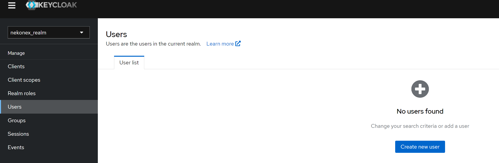

our user will be named nekonex_user put the option Email verified to yes


Then click on Credentials and set password
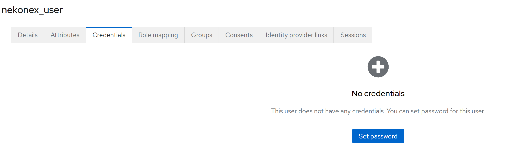

On the password window enter nekonex_password and set temporary to Off


#Congratulations you completed the Keycloak configuration for this tutorial!