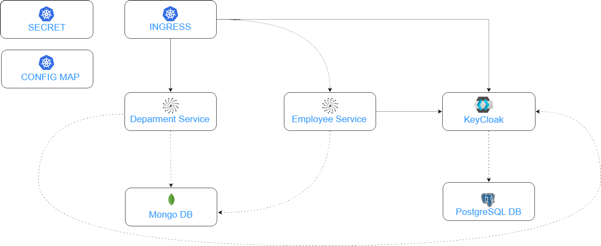

# Guide to Micronaut Kubernetes KeyCloack Sample Project

In this project I'm demonstrating you the most interesting features of [Micronaut Kubernetes Project](https://micronaut-projects.github.io/micronaut-kubernetes/snapshot/guide/) for integration between Micronaut, Keycloak and Kubernetes API.

### Usage
To successfully run example applications you need to have:
1. JDK11+ as a default Java on your machine
2. Maven 3.5+ available under PATH
3. Minikube (I tested on version `1.29.0`)
4. Skaffold available under PATH

## Architecture

Our sample microservices-based system consists of the following modules:
- **employee-service** - a module containing the first of our sample microservices that allows to perform CRUD operation on Mongo repository of employees
- **department-service** - a module containing the second of our sample microservices that allows to perform CRUD operation on Mongo repository of departments. It communicates with employee-service.

The following picture illustrates the architecture described above including Kubernetes objects.



If you have not done so install the dependencies. Instructions can be found in the dedicated section below.
Then proceed by doing `Minikube start`

Before running any application in default namespace we need to set the appropriate permissions.  
Micronaut Kubernetes requires read access to pods, endpoints, secrets, services and config maps.  
For development needs we may set the highest level of permissions by creating ClusterRoleBinding pointing to cluster-admin role.
```
kubectl create clusterrolebinding admin --clusterrole=cluster-admin --serviceaccount=default:default
```

Go to the k8s folder and apply the followin:  
`kubectl apply -f storage-deployment.yaml` : creates a storage for the postgresdb  
`kubectl apply -f postgres-deployment.yaml` : creates the postgresdb that can be used by keycloak. keycloak also support MySQL  
`kubectl apply -f mongo-deployment.yaml` : creates the MongoDB that will be used in our services. Note that usually each service should have it's own DB which is not the case here.  
`kubectl apply -f keycloak-deployment.yaml` : creates the keycloak service and can be accessed by forwarding the port and using the login admin password admin  
`kubectl apply -f ingress-deployment.yaml` : creates the ingress component that can be used to access the different services

Now each of our services can be run in each directory by running
```
skaffold dev
```
kubectl get services check the port of employee service for example :
```
NAME           TYPE        CLUSTER-IP       EXTERNAL-IP   PORT(S)          AGE  
department     NodePort    10.101.202.105   <none>        8080:30266/TCP   88s  
employee       NodePort    10.111.127.76    <none>        8080:30377/TCP   22m  
kubernetes     ClusterIP   10.96.0.1        <none>        443/TCP          12h  
mongodb        ClusterIP   10.106.41.104    <none>        27017/TCP        12h
```  

kubectl get endpoints get the IP of the kubernetes endpoints
```
NAME           ENDPOINTS           AGE
department     10.244.0.8:8080     4m10s
employee       10.244.0.7:8080     25m
kubernetes     192.168.49.2:8443   12h
mongodb        10.244.0.5:27017    12h
```

try then
```
curl http://KUBERNET_HOST:EMPLOYEE_SERVICE_PORT/api/employees -d '{"name":"John Smith","age":30,"position":"director","departmentId":2,"organizationId":2}' -H "Content-Type: application/json"
curl http://KUBERNET_HOST:DEPARTMENT_SERVICE_PORT/api/departments -d '{"name":"Test2","organizationId":2}' -H "Content-Type: application/json"{"id":2,"organizationId":2,"name":"Test2"}
curl http://KUBERNET_HOST:ORGANIZATION_SERVICE_PORT/api/departments/organization/2/with-employees
```

In the examples above
```
curl http://192.168.49.2:30377/api/employees -d '{"name":"John Smith","age":30,"position":"director","departmentId":2,"organizationId":2}' -H "Content-Type: application/json"
curl http://192.168.49.2:30377/api/employees -d '{"name":"Paul Walker","age":50,"position":"director","departmentId":2,"organizationId":2}' -H "Content-Type: application/json"
curl http://192.168.49.2:30266/api/departments -d '{"name":"Test2","organizationId":2}' -H "Content-Type: application/json"
curl http://192.168.49.2:30266/api/departments/organization/2/with-employees
```

If you are using wsl you can forward the services port using
```
kubectl port-forward service/department 30266:8080
```

When applyfing the kubernetes ingress yaml file you can check the status
```
kubectl get ingress
```
As this operation can take a bit of time wait until the IP address is displayed for example
```
NAME              CLASS   HOSTS                  ADDRESS        PORTS   AGE
nekonex-ingress   nginx   nekonex-ingress.info   192.168.49.2   80      66m
```
Please change your /etc/hosts to have the nekones-ingress.info setup for example
```
sudo sh -c 'echo "192.168.49.2 nekonex-ingress.info" >> /etc/hosts'
```

Now instead of querying directly through the pods you can query with ingress for example
```
curl nekonex-ingress.info/api/employees/count
```
#Installing the dependencies

Updating ubuntu packages
```
sudo apt-get update 
sudo apt-get install curl
sudo apt-get install maven
sudo apt install openjdk-17-jdk openjdk-17-jre
```

install docker and kubernetes
```
sudo apt-get install -y docker.io
curl -s https://packages.cloud.google.com/apt/doc/apt-key.gpg | sudo apt-key add
sudo apt-add-repository "deb http://apt.kubernetes.io/ kubernetes-xenial main"
sudo apt-get update
sudo apt-get install -y kubeadm kubelet kubectl
sudo systemctl enable docker
sudo systemctl enable kubelet
sudo systemctl start docker
sudo systemctl start kubelet
sudo curl -LO https://storage.googleapis.com/minikube/releases/latest/minikube-linux-amd64
sudo install minikube-linux-amd64 /usr/local/bin/minikube
minikube addons enable ingress
```

if you have any issues with minikube when starting please use the following command:
```
sudo usermod -aG docker $USER && newgrp docker
```
it will add the user to the user group


#Useful commands:
```
kubectl get ingress --all-namespaces
kubectl delete ingress my-example-ingress
kubectl apply -f https://raw.githubusercontent.com/kubernetes/ingress-nginx/controller-v1.1.0/deploy/static/provider/cloud/deploy.yaml
kubectl get services -n ingress-nginx
kubectl describe ingress ingress
minikube service -n ingress-nginx ingress-nginx-controller --url
kubectl get pods --all-namespaces
kubectl exec -it controller -n namespace -- /bin/sh
```

#Special thanks
Piotr Minkowski for his great [tutorials](https://piotrminkowski.com/), a lot that can be seen in this repository have been created from his tutorials
[ChatGPT](https://chat.openai.com/) for helping me learn and understand more about Kubernetes and Micronaut 