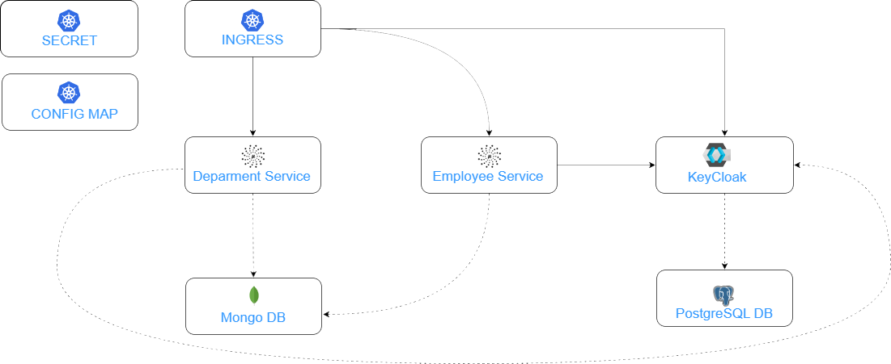

# Guide to Micronaut Kubernetes KeyCloack Sample Project

In this project I'm demonstrating you the most interesting features of [Micronaut Kubernetes Project](https://micronaut-projects.github.io/micronaut-kubernetes/snapshot/guide/) for integration between Micronaut, Keycloak and Kubernetes API.

## Architecture

Our sample microservices-based system consists of the following modules:
- **employee-service** - a module containing the first of our sample microservices that allows to perform CRUD operation on Mongo repository of employees
- **department-service** - a module containing the second of our sample microservices that allows to perform CRUD operation on Mongo repository of departments. It communicates with employee-service.

The following picture illustrates the architecture described above including Kubernetes objects.

## Documentation
Documentation and steps to install and run the services is available under the doc directory

## Special thanks
Piotr Minkowski for his great [tutorials](https://piotrminkowski.com/), a lot that can be seen in this repository have been created from his tutorials  
Sergio del Amo Caballero for understanding more about standard and implicit flow and how to setup keycloak with Micronaut  
[ChatGPT](https://chat.openai.com/) for helping me learn and understand more about Kubernetes and Micronaut 